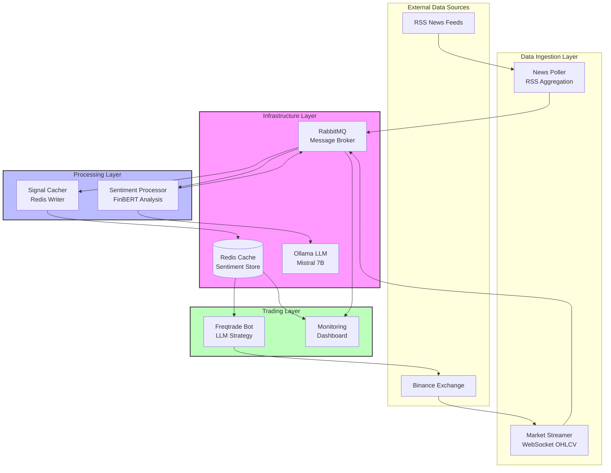
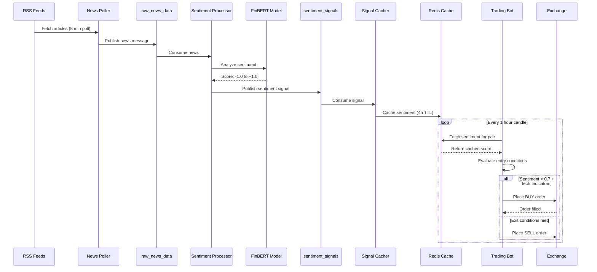
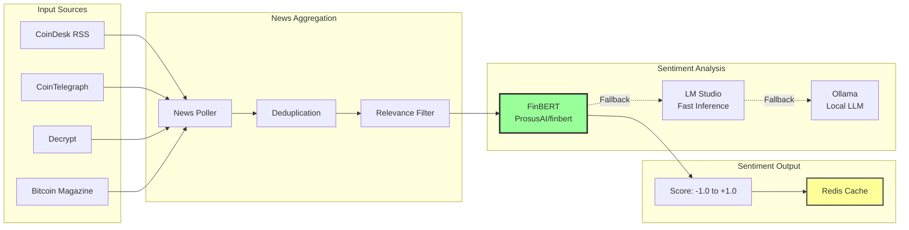
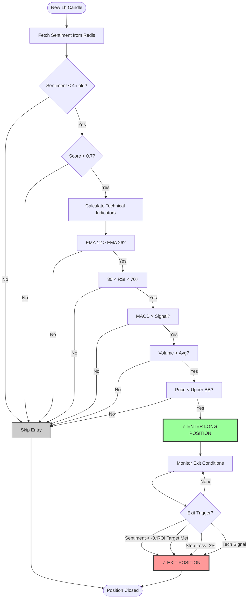
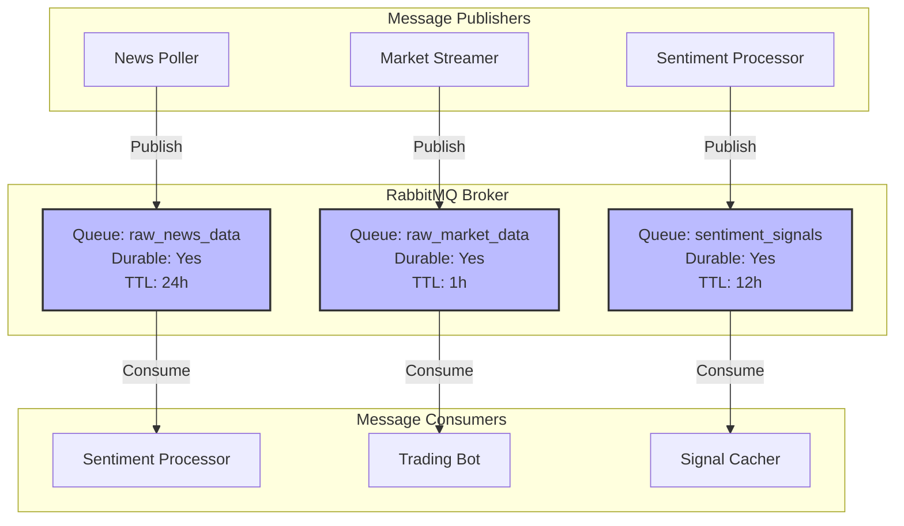
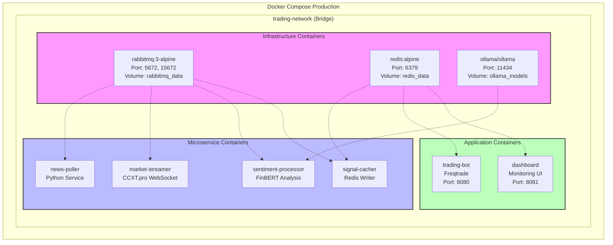
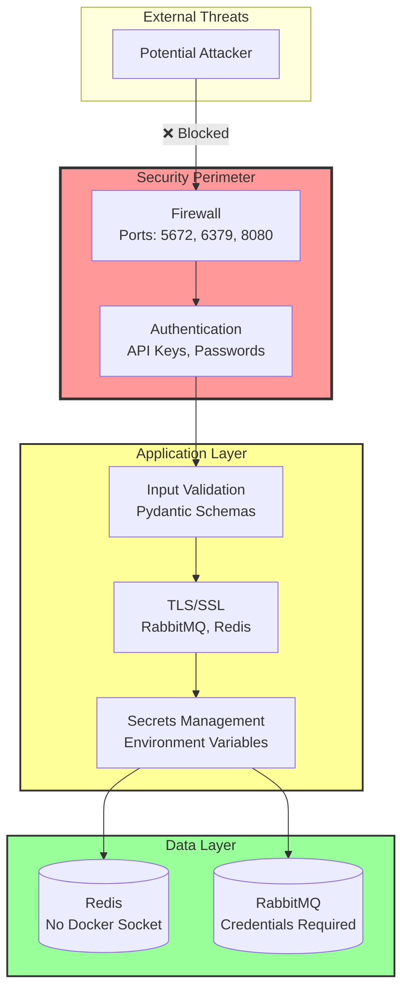
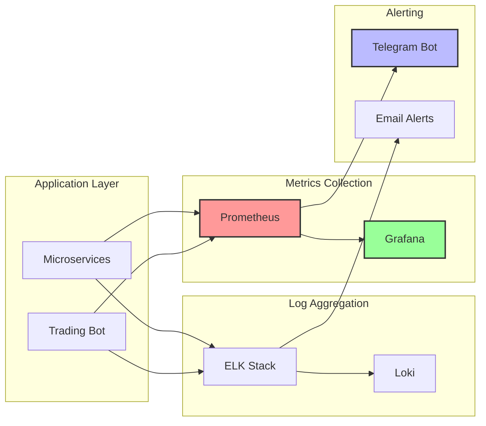

# CryptoBoy Architecture Diagrams
**VoidCat RDC - System Architecture Visualization**

## Table of Contents
1. [High-Level System Overview](#high-level-system-overview)
2. [Microservices Data Flow](#microservices-data-flow)
3. [Sentiment Analysis Pipeline](#sentiment-analysis-pipeline)
4. [Trading Decision Engine](#trading-decision-engine)
5. [Message Queue Architecture](#message-queue-architecture)
6. [Deployment Architecture](#deployment-architecture)

---

## High-Level System Overview

---

## Microservices Data Flow

---

## Sentiment Analysis Pipeline

---

## Trading Decision Engine

---

## Message Queue Architecture

**Message Schemas:**

| Queue | Schema | Example |
|-------|--------|---------|
| `raw_news_data` | `{timestamp, source, title, url, content}` | News article from RSS |
| `raw_market_data` | `{timestamp, pair, open, high, low, close, volume}` | OHLCV candle data |
| `sentiment_signals` | `{timestamp, pair, score, headline, source, confidence}` | Sentiment analysis result |

---

## Deployment Architecture

**Container Resource Limits:**

| Container | CPU | Memory | Storage |
|-----------|-----|--------|---------|
| RabbitMQ | 1 core | 512MB | 1GB (data) |
| Redis | 1 core | 256MB | 500MB (cache) |
| Ollama | 2 cores | 4GB | 5GB (models) |
| Sentiment Processor | 2 cores | 2GB | - |
| Trading Bot | 1 core | 512MB | 1GB (logs) |
| Dashboard | 0.5 core | 256MB | - |

---

## Security Architecture

**Security Measures:**
- ✅ No hardcoded credentials (enforced via ValueError)
- ✅ Docker socket removed (container escape prevention)
- ✅ Input validation with Pydantic schemas
- ✅ TLS/SSL for external communications
- ✅ API authentication with JWT tokens
- ✅ Rate limiting on public endpoints
- ❌ TODO: Secrets management (Vault integration)
- ❌ TODO: Network policies (restrict inter-container traffic)

---

## Performance Characteristics

| Component | Latency | Throughput | Bottleneck |
|-----------|---------|------------|------------|
| News Poller | 5 min cycle | 50 articles/min | RSS feed limits |
| Sentiment Analysis | 200ms/article | 300 articles/min | FinBERT inference |
| Redis Cache | 5-10ms | 10K ops/sec | Network I/O |
| RabbitMQ | 10-50ms | 1K msg/sec | Message size |
| Trading Bot | 1 hour cycle | 3 pairs | Freqtrade strategy |

**Optimization Targets:**
1. **Sentiment Analysis:** Batch processing (5x speedup)
2. **Redis:** Connection pooling (2x throughput)
3. **RabbitMQ:** Prefetch tuning (30% improvement)
4. **News Polling:** Async fetching (5x faster)

---

## Monitoring & Observability

**Key Metrics:**
- Trading: Win rate, Sharpe ratio, drawdown, P&L
- System: CPU, memory, disk I/O, network
- Services: Message queue depth, cache hit rate, latency
- Errors: Exception rate, failed trades, connection errors

---

## Disaster Recovery Plan

| Scenario | Impact | Recovery Time | Strategy |
|----------|--------|---------------|----------|
| Redis failure | No new trades | < 5 minutes | Auto-restart + backup restore |
| RabbitMQ failure | Data loss | < 10 minutes | Durable queues + consumer restart |
| Trading bot crash | Missed signals | < 2 minutes | Docker auto-restart |
| Exchange outage | Cannot trade | Variable | Switch to backup exchange |
| LLM service down | No new sentiment | < 30 minutes | Fallback to cached signals |

**Backup Schedule:**
- Redis: Every 6 hours → JSON dump
- RabbitMQ: Persistent queues (disk)
- Logs: Daily rotation + 30-day retention
- Config: Git version control

---

**Generated by:** The High Evolutionary  
**Date:** November 20, 2025  
**Status:** Phase 6 - Documentation Enhancement
